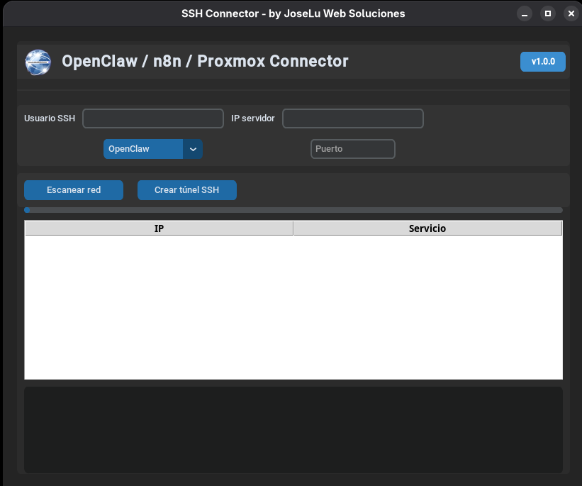

# CONECTOR SSH

* Objetivo
* Configuración / Instalación
* Editor/Lenguaje
* Conclusión

---
## Objetivo
El objetivo de este respositorio es subir mis prácticas, en este caso utilizando cómo lenguaje de programación **Python**.
Después de investigar e ir comparando código, fuí desarrollando de a poco esta app. La misma es con fines educativos, no soy responsable por el uso que se le de a la misma.

En este caso hice un Conector para SSH, si se sabe la ip del servidor al que se quiere conectar se escribe directamente o se puede escanear y del listado haciendo doble clic se completa la ip para la conexión. Está pensado para los puertos de OpenClaw, n8n y Proxmox pero al tener la opción manual se puede poner el puerto que se necesite para crear el túnel SSH. Una vez que se presione en el botón Crear túnel SSH va a abrir una ventana (terminal) con todos los datos y listo para poner la clave del usuario con el que se van a conectar.

## Configuración / Instalación

1. Clonar este repositorio.
2. Crear un entorno virtual y activarlo
   ~~~
   $ python3 -m venv .env
   $ source .env/bin/activate
   ~~~
3. Chequear que pip esté instalado, en caso de que no lo esté instalar pip
   ~~~
   $ pip --version
   

   $ python -m ensurepip --upgrade
   ~~~
4. Instalar las dependencias usando el archivo requirements:
    ~~~
    $ pip install -r requirements.txt
    ~~~
5. En Windows hay que instalar:
    ~~~
    https://nmap.org/download.html
    ~~~

6. Ejecutamos el programa
    ~~~
    $ python3 connectorSSH.py
    ~~~

## Editor/Lenguaje:

## Conclusión
